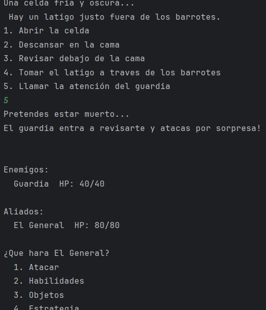

# Fortnite 2: Konkai Wa Kojin Tekina Hanashidesu

## Autores
- Salcido Peralta Jorge Manuel
- Montaño Lares Leonardo
- Félix Espejo Alhetse María
- López González Andrea Guadalupe
- Encinas Rodriguez Jorge Eduardo

## Descripción

Un videojuego de genero RPG basado en combate por turnos para jugar en la terminal. Permite generar archivos de guardado y cargarlos para continuar sin perder el progreso. Tiene un estilo de combate inspirado en franquicias como pokémon, contando con un sistema para determinar el orden de los turnos basado en velocidad y efectos de estado, pero también incorporando elemento de RPGs más clásicos, como una barra de MP que es requerida para realizar ciertas acciones.

